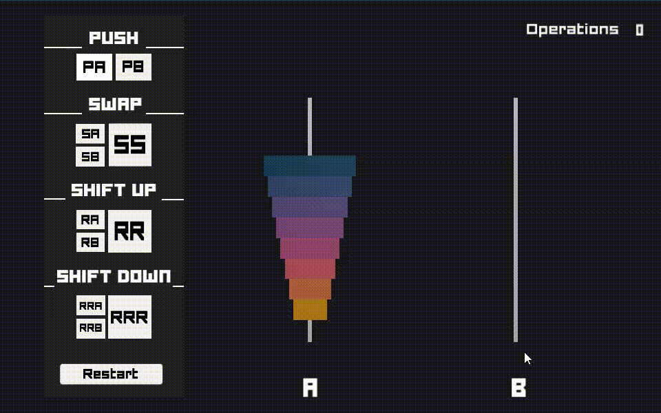

# push_swap
 simple and highly effective algorithm project | école 42

*in process*

* [Introduction](#introduction)
* [Usage](#usage)
* [Step by step](#step_by_step)
* [Study resources](#study_resources)
* [Work Diary](#work_diary)

## introduction

This [project](./study_resources/en.subject.pdf) is about sorting data on a stack, with a limited set of instructions, using the lowest possible number of actions. To succeed I’ll have to manipulate various types of algorithms and choose the one (of many) most appropriate solution for an optimized data sorting.

Push_swap program needs to calculate and display on the standard output the smallest sequence of instruction that sorts the integer arguments received.

The game is composed of 2 stacks named a and b.

*Stack_a* contains a random number of either positive or negative numbers without any duplicates.

*Stack_b* is empty.

The goal is to sort in ascending order numbers into *stack_a* using the following operations:

command  | action |
---|------|
`sa` | swap a - swap the first 2 elements at the top of *stack_a*					|
`sb` | swap b - swap the first 2 elements at the top of *stack_b*	|
`ss` | sa and sb at the same time |
`pa` | push a - take the first element at the top of b and put it at the top of a. Do nothing if b is empty|
`pb` | push b - take the first element at the top of a and put it at the top of b. Do nothing if a is empty |
`ra` | rotate a - shift up all elements of *stack_a* by 1. The first element becomes the last one			|
`rb` | rotate b - shift up all elements of *stack_b* by 1. The first element becomes the last one 		|
`rr` | ra and rb at the same time			|
`rra` |  reverse rotate a - shift down all elements of *stack_a* by 1. The last element becomes the first one	|
`rrb` |  reverse rotate b - shift down all elements of *stack_b* by 1. The last element becomes the first one	|
`rrr` | rra and rrb at the same time		|

## usage

## step_by_step

* to better visualize the instructions we have available, I first built the [push_swap_simulator](https://phemsi-a.itch.io/push-swap)

* error handling

* implementation of functions for each instruction ( *swap*, *push*, *rotate*, *reverse rotate* )

* implementation of my first intuitive sorting algorithm

* studying big O notation and sorting algorithms

* implementation of a sorted array to keep as reference

## study_resources

* [how big_O notation works– explained with cake](https://www.freecodecamp.org/news/big-o-notation/) by [Cedd Burge](https://www.freecodecamp.org/news/author/cedd/)
* [the quicksort sorting algorithm video](https://www.youtube.com/watch?v=uXBnyYuwPe8) by [Back To Back SWE](https://www.youtube.com/channel/UCmJz2DV1a3yfgrR7GqRtUUA)
* [quick sort -ptbr](https://joaoarthurbm.github.io/eda/posts/quick-sort/) by João Arthur Brunet
* [push_swap tester](https://github.com/laisarena/push_swap_tester) by [Lais Arena](https://github.com/laisarena)

## work_diary

  
Click to expand 

* 22/05: After reading the pdf, I felt that it would be good to have a way of visualizing the set of possible instructions that I have, so I started to make a simulator prototype in Unity

* 23/05: simulator prototype finished 

* 24/05: I made a simple makefile to start, coded handling error functions (non-integer inputs, integer overflow and number duplicates) and initialized stack_a with linked lists.

* 25/05: I was having an issue with `0` passing as argument, so I changed the way I was checking if the args are all integers. Swap, push, rotate and reverse rotate are implemented. I chose to change my linked list to make them a doubly linked list, so I can keep track of the previous and the following numbers

* 26/05: Functions to check if stack_a are full and sorted are implemented and working properly

* 27/05: I added a function to check if a stack is reverse-sorted, and implemented a logic to sort the numbers:
  * check if stack_a is sorted and if stack_b is reverse-sorted, to decide what steps to take
  * between three numbers (first, second, and last) from stack_a, define which one is the smallest and send it to stack_b, placing it in the best of the three spots (first, second and last)
  * when stack_a is sorted and stack_b is reverse sorted, push numbers from b to a

* 28/05: While trying to find a bug, I discovered a problem with the swap function in the previous pointer management, and fixed it

* 29/05: The program is being able to sort any amount of numbers without any issues, but it is not optimized, therefore, bigger numbers (>100) are taking too many steps

* 30/05: In order to optimize the code, I studied sorting algorithms and started to code a function that makes an ordered array from the number list

* 31/05: I  organized my variables inside structs and implemented a quick sort function to order the array that will be used as reference. The rest of the day was spent trying to make this new sorting attempt, passing to stack_b the lower half of the list

* 01/06 - 02/06: hello ~~darkness~~ procrastination my old friend

* 03/06: Trying to get small chunks at a time, I started to debug the new messy code with small numbers, step by step, correcting some weird parts and optimizing it a bit. Tomorrow I need to debug a set of numbers that the code is unable to sort (`-44 -12 86 -85 -60`)

* 04/06: I felt that my logic was not going anywhere, so I erased my `lets_sort` function and spent the whole day figuring out another way to sort the numbers. Basically, I'm trying to split the first stack in half, send it to *stack_b* and bring it back already sorting it. By then, I will have a little amount sorted and a bigger amount not sorted, so I send half of the non-sorted part to *stack_b* and repeat the process over and over.

* 05/06: The new sorting logic continued to be implemented and some parts of the code were refactored. I changed many functions to make them recursive, it was a good and joyful exercise.

* 06/06: So, I decided to implement an index in my link list nodes, to better keep track of the numbers without always having to refeer to the ordered array. I implemented the first part of the algorithm, and it's successfully sorting medium-size stacks. 

* 07/06: The basics of the new sorting logic was implemented and is working! It's much better than the last one with 100 numbers, but still pretty inefficient with 500.

* 08/06: The new function to reduce the total amount of instructions by replacing matching neighbors ("ra" and "rb" or "rra" and "rrb" or "sa" or "sb") for their joined versions ("rr", "rrr", "ss") is implemented.

* 09/06: Yesterday I added a function to decide what rotation to make (normal or reverse) and it made a huge difference in the efficience of the code, but it also introduce some more bugs that I'm trying to fix.